# Olá, eu sou o Wesley

## Sobre mim

Desenvolvedor **Backend** focado em **Python, Java e C**. Estudante de Análise e Desenvolvimento de Sistemas no **IFRS**.

Atualmente arquitetando um sistema de gestão automatizada para uma ONG e integrando interfaces web com chatbots para WhatsApp. Estou sempre aprofundando meus conhecimentos em stack de dados e backend.

## Residências e Programas

- [TIC 55 (Unisinos)](https://residenciaemtic.unisinos.br/)
- [Dev Fullstack 5.0 (Instituto Eldorado)](https://informativo.eldorado.org.br/residencia-full-stack)

## Tech Stack

## GitHub Streak

## Projetos em destaque

## Como me encontrar

[LinkedIn](https://www.linkedin.com/in/wesley-moura-6a46311b3) · [wesley03moura@gmail.com](mailto:wesley03moura@gmail.com)
